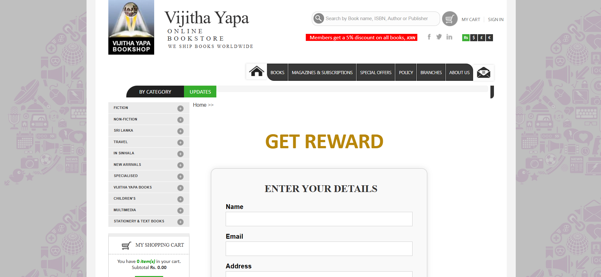

# 🎣 Vijitha Yapa Bookshop – Phishing Simulation Project

  
  
  
  
  

  <strong>Developed by:</strong> Shalini Archana Vidanaarachchi  
   
  An academic phishing simulation to raise awareness of social engineering attacks.

## 📖 Project Overview

This project is a **phishing simulation** created to mimic the **Vijitha Yapa Bookshop** website layout. It demonstrates how attackers might clone legitimate websites to deceive users and collect sensitive data.

The interface includes a **“Get Your Reward”** section, which appears legitimate but secretly captures user details and stores them in a database.

> ⚠️ **This is for cybersecurity awareness, educational use, or academic demonstration only. Do not use this project for malicious or unethical purposes.**

## 🔍 Objective

- 🎯 Educate users on phishing website designs
- 🧠 Demonstrate how front-end mimicry can lead to data theft
- 🛡️ Highlight the importance of verifying site authenticity

## 🛠️ Technologies Used

| Layer         | Technologies                |
|---------------|-----------------------------|
| **Frontend**  | HTML5, CSS3                 |
| **Backend**   | PHP (optional)              |
| **Database**  | MySQL (data logging)        |
| **Attack Simulation** | GET-based form capture |

## 🧪 Features

- 💻 Realistic clone of a bookshop landing page
- 🎁 Fake “Get Reward” section for data entry
- 🗂️ Captures and stores:
  - Name
  - Email
  - Address
  - Phone number
- 📥 All data logged to a backend database for analysis

## 📸 Screenshots

  
   
  <em>⚠️ Fake 'Get Reward' form capturing user info</em>

---

## ⚙️ How It Works

1. The user visits a cloned webpage.
2. Sees a promotional banner: “🎁 Get Your Reward Now!”
3. Fills out the form (Name, Email, Address, Phone).
4. System stores entered data into the MySQL database.
5. Data can be reviewed in the backend (admin-only view).

---

## 🚀 How to Use (Ethically)

> ✅ For ethical use in simulations, training, or penetration testing **with permission only**.

### 🔧 Setup Instructions

# 1. Clone the repo
git clone https://github.com/shaliniarchana/vijithayapa-bookshop.git

# 2. Place project in your local server (XAMPP/WAMP)
cd vijithayapa-bookshop

# 3. Import SQL file to your MySQL

⚠️ Disclaimer
This project is created solely for academic, awareness, and testing purposes.
Any use of this tool for unauthorized phishing or data theft is illegal and strictly prohibited.
Use responsibly and ethically.

👩‍💻 Developer Info
Made with ❤️ by Shalini Archana Vidanaarachchi

    

